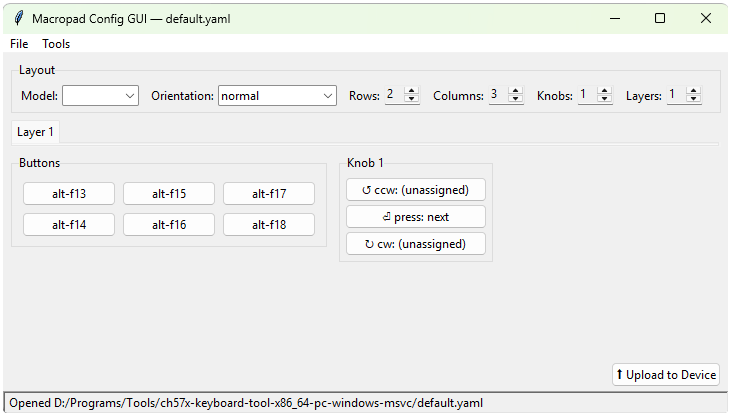

# Macropad Config GUI

A small desktop GUI for creating and editing the YAML configuration files
used by [`ch57x-keyboard-tool`](https://github.com/kriomant/ch57x-keyboard-tool) —
the command-line configurator for the cheap CH57x AliExpress macropads
(the ones with a grid of keys and one or more knobs).

Instead of hand-writing YAML, you set your pad's layout (rows, columns,
knobs), click any button or knob in a visual grid to assign an action,
manage up to three layers, and save a file the tool accepts. A guided
picker builds the action strings for you (modifiers, keys, sequences,
mouse actions, media keys) and validates every entry as you type.

If you have the `ch57x-keyboard-tool` binary installed, the GUI can also
**validate** and **upload** your configuration to the device directly,
without leaving the app.



## Features

- Visual pad editor — set rows (1–8), columns (1–8), knobs (0–4); click
  to assign.
- Up to **3 layers**, each independently editable.
- **Guided action picker** with live validation: keyboard chords and
  sequences, mouse click/move/drag/wheel, and media keys — or type raw
  action strings directly.
- Opens existing hand-written configs and **preserves comments, key
  order, and unknown fields** byte-for-byte on save.
- Safety guards: warns before a layout shrink discards assignments, and
  prompts on close with unsaved changes.
- Optional one-click **Validate** and **Upload to Device** via the
  `ch57x-keyboard-tool` binary.

## Requirements

| Dependency | Required for | Where to get it |
|---|---|---|
| **Python 3.11+** (with Tkinter) | Running the GUI | <https://www.python.org/downloads/> — on Windows, Tkinter is included by default |
| **`ruamel.yaml`** | YAML round-trip I/O | Installed automatically (see below) |
| **`ch57x-keyboard-tool`** | Validating / uploading configs to the device | <https://github.com/kriomant/ch57x-keyboard-tool> |
| **UsbDk** (Windows only) | Letting the tool talk to the macropad over USB | <https://github.com/daynix/UsbDk> |

The GUI itself only needs Python + `ruamel.yaml`; it can create and edit
valid config files with nothing else installed. The `ch57x-keyboard-tool`
binary and **UsbDk** are only needed if you want the in-app **Upload to
Device** / **Validate** buttons to work. On Windows, uploading requires
the [UsbDk](https://github.com/daynix/UsbDk) driver — install it before
trying to upload, otherwise the tool cannot open the device.

## Installation

Clone this repository, then install the package (this pulls in
`ruamel.yaml`):

```powershell
git clone https://github.com/<your-username>/macropad-gui.git
cd macropad-gui
python -m pip install -e .
```

Using a virtual environment is recommended:

```powershell
python -m venv .venv
.venv\Scripts\Activate.ps1      # PowerShell;  on macOS/Linux: source .venv/bin/activate
python -m pip install -e .
```

## Running

```powershell
python -m macropad_gui
```

On Windows you can also double-click `launch_macropad_gui.bat`.

## Usage

1. Set **rows**, **columns**, and **knobs** to match your pad; the grid
   redraws to match.
2. Click any button (or a knob's ↺ / ⏎ / ↻) to open the action editor.
   Compose an action with the guided tabs, or type a raw action string —
   it's validated live.
3. Use the **Layer 1/2/3** tabs to give each layer its own mappings.
4. **File → Save** writes a `.yaml` file `ch57x-keyboard-tool` accepts.
5. With the tool installed, **⬆ Upload to Device** (or **Tools → Upload
   to Device**) programs the currently shown configuration onto the
   connected macropad.

For the full action syntax (key names, modifiers, sequences, mouse and
media actions), see the upstream
[`doc/actions.md`](https://github.com/kriomant/ch57x-keyboard-tool/blob/master/doc/actions.md).

### Where the GUI looks for the tool binary

The **Validate** / **Upload** features are enabled only when a
`ch57x-keyboard-tool` binary is found. The GUI searches, in order:

1. Anywhere on your `PATH`
2. `ch57x-keyboard-tool/target/release/`
3. `ch57x-keyboard-tool/target/debug/`

The simplest setup is to put the binary on your `PATH`. Alternatively,
clone and build the tool inside this folder so the `target/` paths match.

## Development

```powershell
python -m pip install -e ".[dev]"     # installs pytest
pytest
```

The codebase keeps a strict split:

- `src/macropad_gui/` — headless core (`model.py`, `actions.py`,
  `yaml_io.py`, `cli_bridge.py`), no GUI imports, fully unit-tested.
- `src/macropad_gui/ui/` — the only place Tkinter is imported.
- `tests/` — pytest suite. `tests/fixtures/example-mapping.yaml` is a
  vendored copy of the upstream example, used as the golden round-trip
  fixture so the suite needs no external checkout.

## License

Released under the **GNU General Public License v3.0 or later** — see
[LICENSE](LICENSE).

## Acknowledgements

This is a front-end for
[kriomant/ch57x-keyboard-tool](https://github.com/kriomant/ch57x-keyboard-tool);
all device communication and the configuration format are defined by that
project. USB access on Windows is provided by
[Daynix/UsbDk](https://github.com/daynix/UsbDk).
